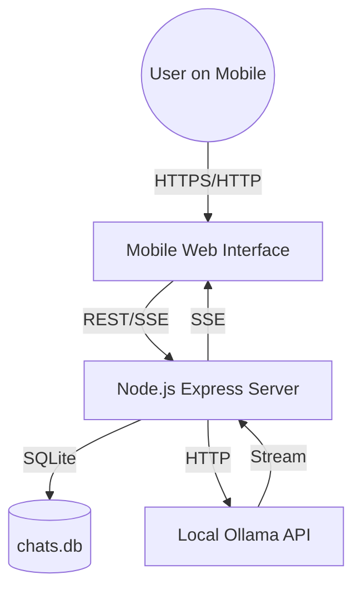

# Ollama Phone Chat - Code Documentation

## Project Architecture
Ollama Phone Chat is a lightweight, mobile-first web application that acts as a bridge to your local [Ollama](https://ollama.com/) instance. It consists of a Node.js backend and a Vanilla JS frontend, using SQLite for persistent chat storage.

### High-Level Component Diagram

---

## File & Folder Structure

| Path | Description |
| :--- | :--- |
| `server.js` | Main entry point. Handles routing, Ollama detection, and SSE streaming. |
| `db.js` | Database initialization and promisified SQLite wrappers. |
| `public/` | Static files for the frontend. |
| `public/index.html` | The main UI structure (mobile-first). Includes font size controls. |
| `public/app.js` | Frontend logic: state management, SSE handling, UI rendering, and font scaling. |
| `public/styles.css` | Design system, responsive layouts, and typography presets. |
| `data/` | Directory containing the SQLite database (`chats.db`). |
| `models_cache.json` | Local cache of Ollama models for offline/fallback mode. |
| `seed_prompt.txt` | Default system prompt template. |
| `start.bat` / `start.sh` | Cross-platform launcher scripts. |

---

## Core Modules & API

### Backend (`server.js`)
The backend is built with Express and provides the following API endpoints:

| Endpoint | Method | Description |
| :--- | :--- | :--- |
| `/api/status` | GET | Returns connection status, LAN IP, and port. |
| `/api/models` | GET | Lists available Ollama models (with caching). |
| `/api/chats` | GET | Fetches all chat histories from the database. |
| `/api/chats/:id`| GET | Fetches details and messages for a specific chat. |
| `/api/chat` | POST | Main chat endpoint. Supports Server-Sent Events (SSE). |
| `/api/chats/:id`| DELETE| Deletes a chat history. |

### Database (`db.js`)
Uses `sqlite3` to manage two primary tables:
- **`chats`**: Stores chat metadata (title, model, timestamps).
- **`messages`**: Stores message contents, roles (user/assistant), and "thinking" blocks.

---

## Data Flow

1.  **Detection**: On startup, the server attempts to detect a local Ollama instance at `http://localhost:11434`.
2.  **Connection**: The server generates a QR code in the terminal for the user to scan with their phone.
3.  **Interaction**:
    -   When a user sends a message, `app.js` sends a `POST` request to `/api/chat`.
    -   The server forwards the request to Ollama and streams the response back to the client using **Server-Sent Events (SSE)**.
    -   Messages are persisted to `chats.db` in real-time.
4.  **UI Updates**: `app.js` parses the SSE stream, renders Markdown using `marked`, and sanitizes output with `DOMPurify`.

---

## Dependencies

### Runtime
- `express`: Web server framework.
- `sqlite3`: Database engine.
- `node-fetch`: For communicating with the Ollama API.
- `qrcode-terminal`: Generates QR codes for easy mobile connection.
- `dotenv`: Environment variable management.

### Frontend
- `marked`: Markdown parsing.
- `DOMPurify`: HTML sanitization.
- `highlight.js`: Code syntax highlighting.

---

## Execution Flow
1.  **Launch**: Run `start.bat` or `npm start`.
2.  **Server Init**: `server.js` starts, initializes the database via `db.js`, and looks for Ollama.
3.  **Ready**: Terminal displays a QR code.
4.  **Client Connect**: Mobile browser opens the LAN IP; `app.js` initializes state and fetches models.
5.  **Chat**: User selects a model and starts chatting.
