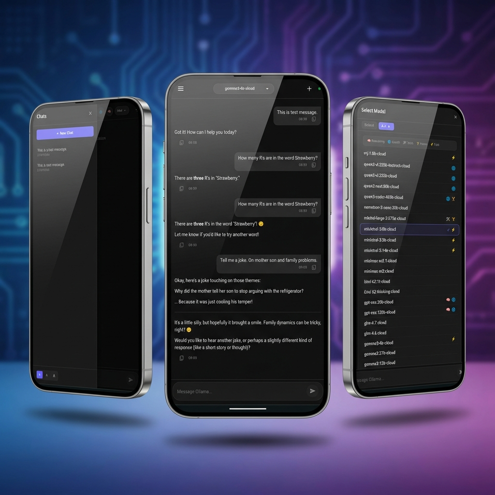

# Ollama Phone Chat

[](https://www.gnu.org/licenses/gpl-3.0)
[](https://nodejs.org/)

**Ollama Phone Chat** is a seamless bridge for chatting with local and cloud [Ollama](https://ollama.com/) models from your mobile devices. It transforms your desktop's AI capabilities into a private, mobile-first experience with zero configuration.



---

## 🚀 Key Features

-   **Zero-Config Connection**: Just scan the QR code in your terminal and start chatting.
-   **Mobile-First Design**: A premium, responsive interface designed for thumbs and small screens.
-   **"Thinking" Support**: Visualize the reasoning process of models (like DeepSeek) in real-time.
-   **Persistent History**: Locally stored SQLite database keeps your chats private and accessible.
-   **Quality Presets**: Adjust model performance (High/Med/Low) directly from your phone.
-   **Font Size Controls**: Three adjustable text sizes (Small/Med/Large) for optimal readability.
-   **Encrypted History**: Messages are encrypted at rest using AES-256 (requires `APP_PASSWORD`).
-   **Secure Access**: Lock your bridge with a password for safe LAN/WAN usage.
-   **Privacy First**: 100% local. Your data never leaves your home network.

---

## 🛠️ Quick Start

1.  **Ensure Ollama is running** on your computer.
2.  **Clone the repo**:
    ```bash
    git clone https://github.com/krishnakanthb13/ollama_phone_chat.git
    cd ollama_phone_chat
    ```
3.  **Install & Start**:
    ```bash
    npm install
    npm start
    ```
4.  **Connect**: Scan the QR code shown in your terminal with your phone.

### 🔒 Securing your Bridge
To enable encryption and password protection, add an `APP_PASSWORD` to your `.env` file:
```env
APP_PASSWORD=your_secret_password_here
```
When set, all messages saved to the database will be encrypted with **AES-256-CBC**, and the web interface will require this password to grant access.

---

## 📖 Documentation

-   [**Code Documentation**](./CODE_DOCUMENTATION.md): High-level architecture and module overview.
-   [**Design Philosophy**](./DESIGN_PHILOSOPHY.md): Why we built this and the principles behind it.
-   [**Contributing**](./CONTRIBUTING.md): How to report bugs and submit pull requests.
-   [**Security Policy**](./SECURITY.md): Security implementation details and recommendations.

---

## 🔒 Security Note
By default, this bridge is accessible to anyone on your Local Area Network (LAN). For security recommendations regarding public exposure, see our [Security Policy](./SECURITY.md).

---

## 📄 License
This project is licensed under the **GNU GPL v3** - see the [LICENSE](./LICENSE) file for details.

---

## 👤 Author
**Krishna Kanth B**  
- GitHub: [@krishnakanthb13](https://github.com/krishnakanthb13)
